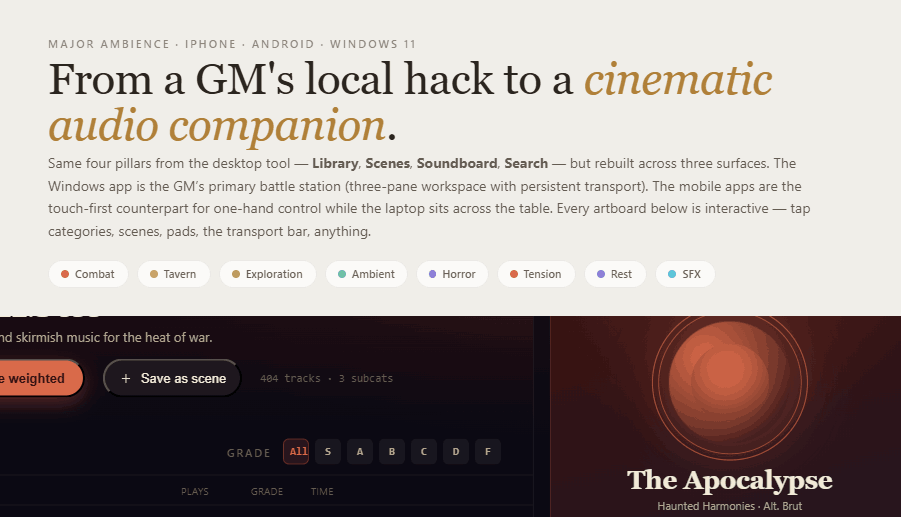
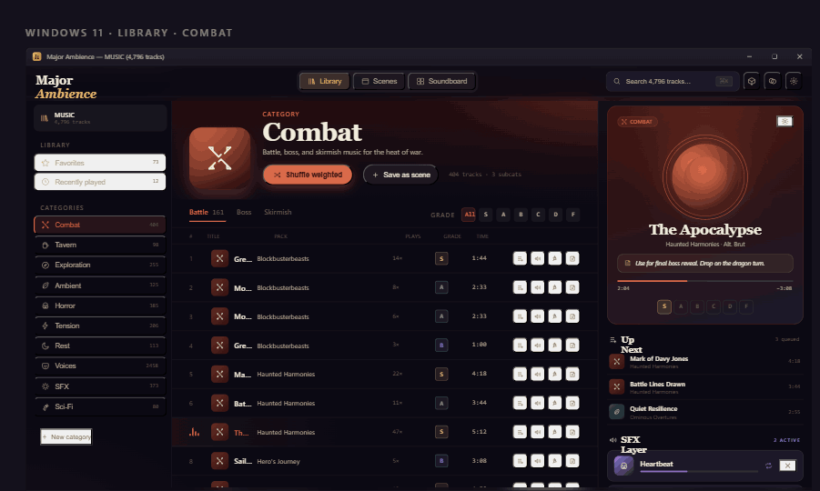
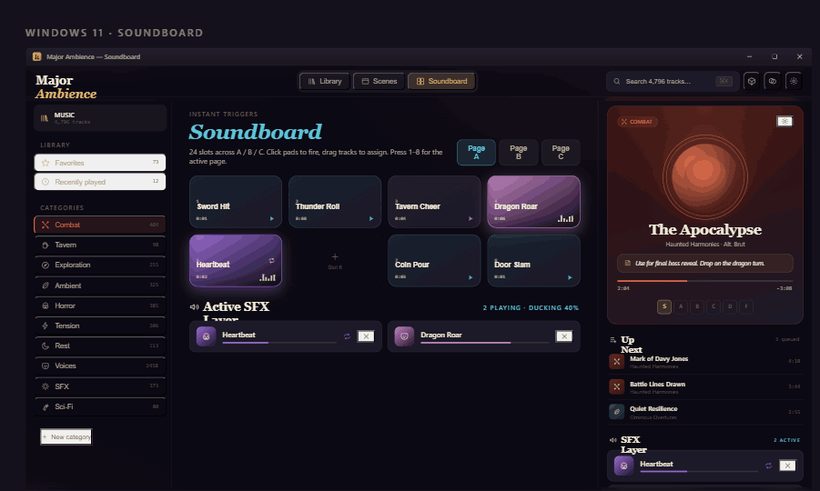
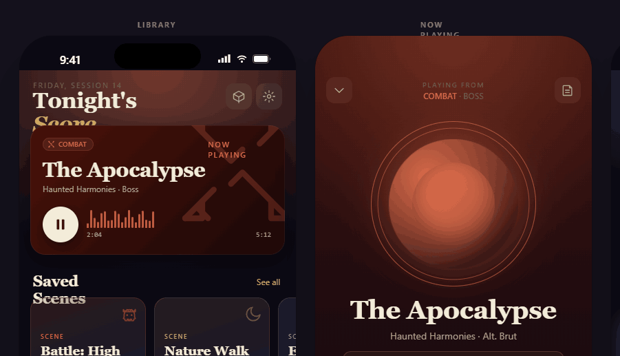
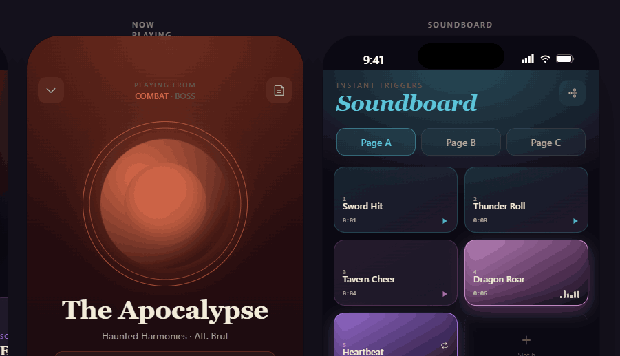
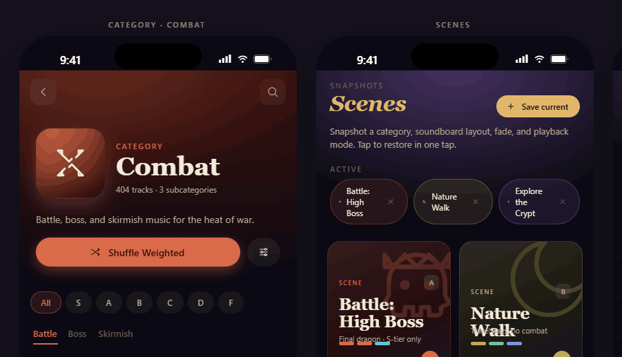

# Major Ambience

[](https://github.com/Rayzold/Major-Ambience/actions/workflows/ci.yml) [](https://rayzold.github.io/Major-Ambience/)

> Music, ambience, and sound effects for tabletop RPGs.

**Landing page:** [rayzold.github.io/Major-Ambience](https://rayzold.github.io/Major-Ambience/) · **Interactive prototype:** [/prototype](https://rayzold.github.io/Major-Ambience/prototype/)

A GM's audio companion for iOS, Android, and Windows 11 — designed to score the tavern, cue the dragon, and fade to silence on command. Built around the workflow of a sitting Dungeon Master with a 4,000+ track library and zero patience for a fiddly interface.



---

## Status

**In active development.** The pnpm monorepo now holds working app builds, not just a prototype:

- **Desktop app** (`apps/desktop`) — Tauri 2 + React 19 + Vite. The most built-out surface: library, Now Playing, scenes, soundboard, SFX, search, DM Toolkit, and a handout (second-screen) window.
- **Mobile app** (`apps/mobile`) — React Native + Expo, at feature parity with desktop for the v0.x set (see [`CHANGELOG.md`](CHANGELOG.md)).
- **Shared packages** (`packages/*`) — `@mc/core` (categorization, weighted shuffle, DM tools, sync-merge, entitlements), `@mc/data` (SQLite repos), `@mc/ui` (design system), and `@mc/sync` (cloud-sync HTTP client).
- **Planning + design docs** — [`docs/BUILD_GUIDE.md`](docs/BUILD_GUIDE.md) (tech stack, audio engine, data model, sync, monetization), [`docs/CATEGORIZATION_GUIDE.md`](docs/CATEGORIZATION_GUIDE.md), and [`docs/CLOUD_SYNC.md`](docs/CLOUD_SYNC.md).
- **Interactive HTML prototype** (`prototype/`) — the original design reference, still runnable (see below).

`pnpm -r typecheck` and `pnpm -r test` are green (228 tests across `@mc/core` + `@mc/sync`). **Cloud sync is partially landed** — merge primitives, the HTTP client, and the entitlement gate are built and tested; the backend (Cloudflare Worker + auth) and in-app wiring are still to come. See [`docs/CLOUD_SYNC.md`](docs/CLOUD_SYNC.md) for the remaining PR sequence.

---

## What it does

| Pillar | What you get |
|---|---|
| **Library** | Auto‑categorize your music folder into Combat, Tavern, Exploration, Ambient, Horror, Tension, Rest, Voices, SFX, and Sci‑Fi. Filter, search, grade, and shuffle by weight (S=6×, A=4×, B=2×, C/D=1×, F=never). |
| **Now Playing** | Cinematic full‑screen player with category‑tinted visualizer, crossfade slider, ducking, in‑line grade rail, and Up Next queue. |
| **Scenes** | Snapshot category, soundboard layout, fade, and volume into a named scene. Tap to restore the whole table mood in one move. |
| **Soundboard** | Three pages (A/B/C) × 8 pads each. Drag a track onto a slot or pin from anywhere. Pads light up when playing, support loop + per‑pad volume. |
| **SFX Layer** | Fire any sound effect alongside the main track. The music bus ducks automatically while SFX are active. Per‑SFX volume, loop toggle. |
| **Search** | Global, fuzzy, across the whole library. Filters by grade, length, and category. |
| **DM Mode** | One toggle hides editing controls and shows a red DM badge — safe to share the screen with players. |

---

## Screenshots

### Windows 11 — primary GM surface

Three‑pane workspace: categories, tracks, and a persistent Now Playing + Queue + SFX rail. Transport stays anchored at the bottom across all views.





### Mobile — touch‑first GM companion

The phone sits next to the laptop for one‑hand control while running the table.







---

## Run the prototype locally

The prototype is a single static HTML file with no build step.

```bash
git clone https://github.com/Rayzold/Major-Ambience.git
cd Major-Ambience/prototype
# Serve over HTTP (any static server works; the file: protocol won't load Babel modules)
python3 -m http.server 8000
# or:  npx serve .
```

Then open <http://localhost:8000/> and click around any artboard.

> The prototype uses React 18 + Babel standalone for runtime JSX transpilation, so it loads in any modern browser without a build step. It remains the design reference; the production apps are built with the stack in [`docs/BUILD_GUIDE.md`](docs/BUILD_GUIDE.md).

---

## Run the apps

The monorepo uses [pnpm](https://pnpm.io/) (see `engines` in `package.json` for required versions).

```bash
pnpm install          # install the whole workspace
pnpm -r typecheck     # type-check every project
pnpm -r test          # run the @mc/core + @mc/sync test suites

pnpm desktop          # launch the desktop app (Tauri dev)
pnpm --filter @mc/mobile start   # start the Expo dev server (needs a device/simulator)
```

The desktop app additionally needs the [Tauri 2 prerequisites](https://v2.tauri.app/start/prerequisites/) (Rust toolchain + platform WebView).

---

## Tech direction (summary)

Full reasoning lives in [`docs/BUILD_GUIDE.md`](docs/BUILD_GUIDE.md). The short version:

| Layer | Choice |
|---|---|
| Mobile | React Native + Expo (dev‑client) |
| Desktop | Tauri 2 + React + Vite |
| Shared core | pnpm monorepo, TypeScript |
| Audio | Web Audio API (desktop) + react‑native‑track‑player (mobile) |
| Storage | SQLite + FTS5 local; ~100 KB config blob syncs via Cloudflare Workers + KV |
| Monetization | One‑time Pro purchase, no subscription |

Files don't sync. Audio stays on device — only your grades, scenes, notes, and soundboard layouts move between your phone and laptop.

---

## Repository layout

```
.
├── README.md                     ← you are here
├── LICENSE
├── pnpm-workspace.yaml           ← monorepo: apps/* + packages/*
├── apps/
│   ├── desktop/                  ← Tauri 2 + React + Vite (Windows)
│   └── mobile/                   ← React Native + Expo (iOS + Android)
├── packages/
│   ├── core/                     ← categorize, shuffle, DM tools, sync-merge, entitlements
│   ├── data/                     ← SQLite repos (tracks, scenes, soundboard, config, sync)
│   ├── ui/                       ← design tokens, glyphs, shared components
│   └── sync/                     ← cloud-sync HTTP client (@mc/sync)
├── prototype/
│   ├── index.html                ← interactive multi‑platform prototype
│   └── app/                      ← mock data + per-platform device frames
└── docs/
    ├── BUILD_GUIDE.md            ← full design + engineering handoff
    ├── CATEGORIZATION_GUIDE.md   ← music auto‑categorization rules
    ├── CLOUD_SYNC.md             ← Phase 2 cloud-sync implementation plan
    └── screenshots/
```

---

## Roadmap

See [`docs/BUILD_GUIDE.md § 10`](docs/BUILD_GUIDE.md#10-phased-roadmap) for the seven‑phase plan. Headline: **MVP on one platform in ~10 weeks, all three platforms in users' hands in ~22 weeks.**

---

## License

MIT — see [`LICENSE`](LICENSE).

> The repository contains no audio files. Major Ambience is a player; you supply your own music and effects. Curated content packs (sold via in‑app purchase) will live in a separate repo at the appropriate phase.
